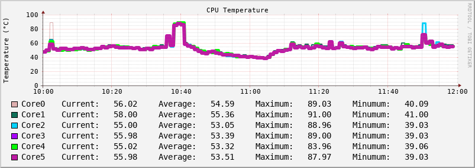
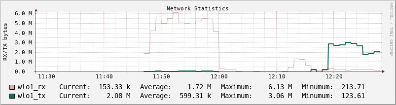

# Round Robbin Database

This is repo how to plot a graph using rrdtool to log my personal laptop's temperature. 
For more information about RRD see following links.

[official](https://oss.oetiker.ch/rrdtool/)

[vandenbogaerdt](http://rrdtool.vandenbogaerdt.nl/tutorial/)


## Create Database

```bash
rrdtool create cputemp.rrd      \
    --step 60 --start N         \
    DS:Core0:GAUGE:120:U:100    \
    DS:Core1:GAUGE:120:U:100    \
    DS:Core2:GAUGE:120:U:100    \
    DS:Core3:GAUGE:120:U:100    \
    DS:Core4:GAUGE:120:U:100    \
    DS:Core5:GAUGE:120:U:100    \
    RRA:AVERAGE:0.5:1:1200      \
    RRA:MIN:0.5:12:2400         \
    RRA:MAX:0.5:12:2400         \
    RRA:AVERAGE:0.5:12:2400
```
*Note:* You can install ```rrd``` on ubuntu ```sudo apt install rrdtool```

## Create Script
Following shell script get CPU Core temperatures and update database ```cputemp.rrd```. 
### logcputemp.sh

```bash
#!/bin/bash

rrd_column=""
rrd_data=""
tmp_data=""
tmp_column=""
raw_data=$(sensors -j)
declare -A core_temps
# TODO: Enhance JQ to dynamically map CPU Core with its temperature.[Core0:30C, Core1:50]
#jq  '[.[]| to_entries[] | select(.key|test("Core"))] | from_entries|map_values(to_entries[]|select(.key|test("input")).value)' sensor.json 
tmp=$(echo "${raw_data}" | jq '[.[]| to_entries[] | select(.key|test("Core"))] | from_entries|map_values(to_entries[]|select(.key|test("input")).value)')

#Core 0, Core 1
mapfile -t idx_core<<<$(echo "${tmp}" | jq -r   keys[])

for idx in "${idx_core[@]}"
do
	temp=$(echo "${tmp}" | jq  --arg id  "$idx" '.[$id]')
	#core_temps["${idx}"]="${temp}"
	tmp_column+="$idx:"
	tmp_data+="${temp}:"
done

rrd_column=$(echo ${tmp_column::-1}| tr -d ' ')
rrd_data=$(echo ${tmp_data::-1}| tr -d ' ')

#echo "rrdtool update cputemp.rrd -t ${rrd_column} N:${rrd_data}"
rrdtool update cputemp.rrd -t "${rrd_column}" "N:${rrd_data}"
```

```
cat t.json | jq '.|to_entries[]|select(.key|test("^Core\\s"))|{cpu: .key, value: .value}'
```


## Set Crontab

```bash
*/1 * * * * </path>/logcputemp.sh
```

## Check Data
```bash
rrdtool fetch cputemp.rrd AVERAGE -r 60 -s -10m
```

## Run Stress Test 
```bash
stress --cpu 6 --io 4 --vm 2 --vm-bytes 128M --timeout 120m
```


## Create Temp Graph

```bash
rrdtool graph cputemp.png \
--imgformat=PNG \
--start=-120m \
--title='CPU Temperature' \
--rigid \
--base=1000 \
--height=120 \
--upper-limit=100 \
--width=700 \
--alt-autoscale-max \
--lower-limit=0 \
--vertical-label "Temperature (°C)" \
--slope-mode \
--font TITLE:8: \
--font AXIS:8: \
--font LEGEND:10: \
--font UNIT:8: \
DEF:a="cputemp.rrd":Core0:AVERAGE \
DEF:b="cputemp.rrd":Core1:AVERAGE \
DEF:c="cputemp.rrd":Core2:AVERAGE \
DEF:d="cputemp.rrd":Core3:AVERAGE \
DEF:e="cputemp.rrd":Core4:AVERAGE \
DEF:f="cputemp.rrd":Core5:AVERAGE \
LINE1:a#DEAFAF:"Core0"  \
GPRINT:a:LAST:" Current\:%8.2lf %s"  \
GPRINT:a:AVERAGE:"Average\:%8.2lf %s"  \
GPRINT:a:MAX:"Maximum\:%8.2lf %s"  \
GPRINT:a:MIN:"Minumum\:%8.2lf %s\n"  \
LINE2:b#0F7059:"Core1"  \
GPRINT:b:LAST:" Current\:%8.2lf %s"  \
GPRINT:b:AVERAGE:"Average\:%8.2lf %s"  \
GPRINT:b:MAX:"Maximum\:%8.2lf %s"  \
GPRINT:b:MIN:"Minumum\:%8.2lf %s\n"  \
LINE3:c#03D3FC:"Core2"  \
GPRINT:c:LAST:" Current\:%8.2lf %s"  \
GPRINT:c:AVERAGE:"Average\:%8.2lf %s"  \
GPRINT:c:MAX:"Maximum\:%8.2lf %s"  \
GPRINT:c:MIN:"Minumum\:%8.2lf %s\n"  \
LINE4:d#A903FC:"Core3"  \
GPRINT:d:LAST:" Current\:%8.2lf %s"  \
GPRINT:d:AVERAGE:"Average\:%8.2lf %s"  \
GPRINT:d:MAX:"Maximum\:%8.2lf %s"  \
GPRINT:d:MIN:"Minumum\:%8.2lf %s\n"  \
LINE5:d#03FC03:"Core4"  \
GPRINT:e:LAST:" Current\:%8.2lf %s"  \
GPRINT:e:AVERAGE:"Average\:%8.2lf %s"  \
GPRINT:e:MAX:"Maximum\:%8.2lf %s"  \
GPRINT:e:MIN:"Minumum\:%8.2lf %s\n"  \
LINE6:f#BF19A4:"Core5"  \
GPRINT:f:LAST:" Current\:%8.2lf %s"  \
GPRINT:f:AVERAGE:"Average\:%8.2lf %s"  \
GPRINT:f:MAX:"Maximum\:%8.2lf %s"  \
GPRINT:f:MIN:"Minumum\:%8.2lf %s\n"  \
```





## Network Monitoring

```
 rrdtool create netstat.rrd   \
    --step 60 --start N  \
    DS:wlo1_rx:DERIVE:600:0:U \
    DS:wlo1_tx:DERIVE:600:0:U  \     
    RRA:AVERAGE:0.5:1:288 \
    RRA:AVERAGE:0.5:3:672 \    
    RRA:AVERAGE:0.5:12:744  \
    RRA:AVERAGE:0.5:72:1480 \
```

## Crontab

```bash
*/1 * * * * ~/netstat.sh wlo1
```
#### netstat.sh
```bash
#!/bin/bash
declare -A stats
#tmp=$(ethtool -S wlo1 | grep -E '(tx|rx)_bytes' | tr -d ' ')
#stats[rx_bytes]=$(echo "$tmp" | awk -F ":" '/rx_bytes/{print $2}')
#stats[tx_bytes]=$(echo "$tmp" | awk -F ":" '/tx_bytes/{print $2}')

if [ "$#" -ne 1 ]; then
  echo "Usage: $0 <iface name>" >&2
  exit 1
fi
iface=${1}

stats[rx_bytes]=$(cat "/sys/class/net/${iface}/statistics/rx_bytes")
stats[tx_bytes]=$(cat "/sys/class/net/${iface}/statistics/tx_bytes")

echo ${stats[rx_bytes]}
echo ${stats[tx_bytes]}

rrdtool update ~/netstat.rrd -t "${iface}_rx:${iface}_tx" "N:${stats[rx_bytes]}:${stats[tx_bytes]}"
```


```bash
rrdtool graph netsat.png \
--imgformat=PNG \
--start=-3600 \
--title='Network Statistics' \
--rigid \
--base=1000 \
--height=120 \
--width=700 \
--alt-autoscale-max \
--lower-limit=0 \
--vertical-label "RX/TX bytes" \
--slope-mode \
--font TITLE:8: \
--font AXIS:8: \
--font LEGEND:10: \
--font UNIT:8: \
DEF:a="netstat.rrd":wlo1_rx:AVERAGE \
DEF:b="netstat.rrd":wlo1_tx:AVERAGE \
LINE1:a#DEAFAF:"wlo1_rx"  \
GPRINT:a:LAST:" Current\:%8.2lf %s"  \
GPRINT:a:AVERAGE:"Average\:%8.2lf %s"  \
GPRINT:a:MAX:"Maximum\:%8.2lf %s"  \
GPRINT:a:MIN:"Minumum\:%8.2lf %s\n"  \
LINE2:b#0F7059:"wlo1_tx"  \
GPRINT:b:LAST:" Current\:%8.2lf %s"  \
GPRINT:b:AVERAGE:"Average\:%8.2lf %s"  \
GPRINT:b:MAX:"Maximum\:%8.2lf %s"  \
GPRINT:b:MIN:"Minumum\:%8.2lf %s\n"  \
```





